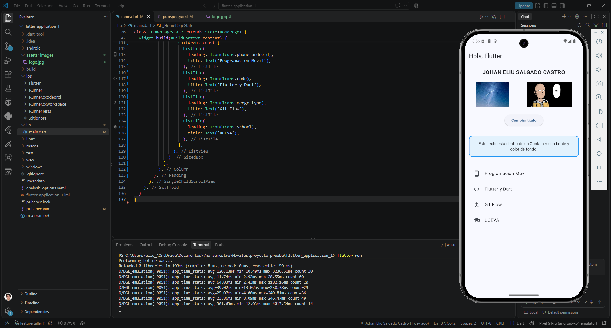
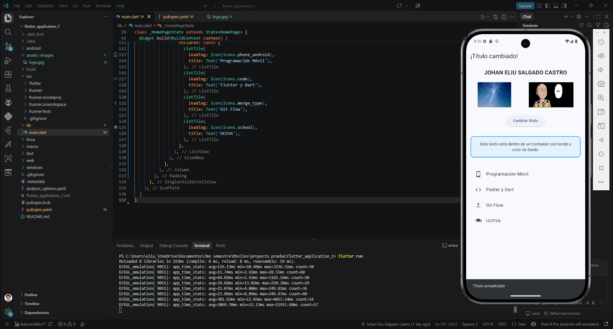
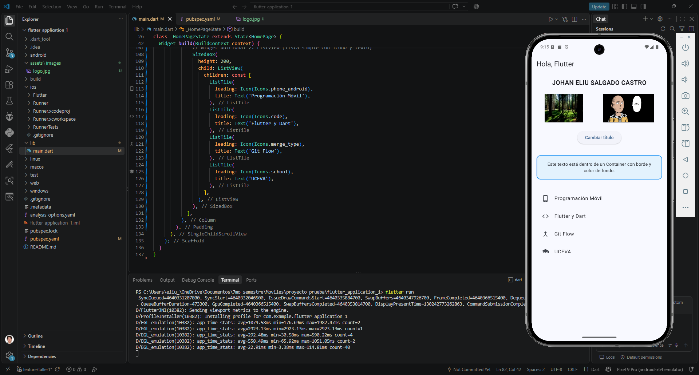

# Taller 1 – Flutter + Widgets + Git Flow

## Descripción

Este taller consiste en construir una pantalla básica en Flutter utilizando un
`StatefulWidget`, evidenciando el uso de `setState()` para actualizar la interfaz
de forma dinámica. La pantalla incluye un `AppBar` con título variable, imágenes
cargadas desde red y desde assets locales, un botón que cambia el estado de la
aplicación mostrando un `SnackBar`, y widgets adicionales (`Container` y `ListView`)
organizados con buenas prácticas de diseño visual.

Además, se aplicó un flujo de trabajo Git Flow: todos los cambios se desarrollaron
en la rama `feature/taller1`, creada a partir de `dev`, y luego integrados mediante
Pull Requests hacia `dev` y posteriormente hacia `main`.

## Datos del estudiante

- **Nombre completo:** Johan Eliu Salgado Castro
- **Código:** 230232033
- **Asignatura:** Electiva profesional I
- **Taller:** Taller 1 – Flutter + Widgets + Git Flow

## Requisitos técnicos implementados

- `AppBar` con título inicial "Hola, Flutter", controlado por una variable de estado.
- `Text` centrado con el nombre completo del estudiante.
- `Row` con dos imágenes: una cargada con `Image.network()` y otra con `Image.asset()`.
- `ElevatedButton` que alterna el título de la `AppBar` entre "Hola, Flutter" y
  "¡Título cambiado!" usando `setState()`.
- `SnackBar` con el mensaje "Título actualizado" al presionar el botón.
- Widgets adicionales:
  - `Container` con márgenes, color de fondo y bordes.
  - `ListView` con 4 elementos, cada uno con ícono y texto.
- Diseño organizado con `Column`, `Padding`, `SizedBox` y alineaciones adecuadas.

## Uso de StatefulWidget y setState()

La pantalla principal (`HomePage`) es un `StatefulWidget` porque necesita mantener
y modificar un estado interno mientras la aplicación está en ejecución: en este
caso, la variable booleana `_cambiado`, que determina el texto mostrado en el
`AppBar`. Cada vez que el usuario presiona el botón "Cambiar título", se llama al
método `_cambiarTitulo()`, el cual invoca `setState()` para alternar el valor de
`_cambiado`. Esto le indica a Flutter que debe volver a ejecutar el método `build()`
y redibujar la interfaz con el nuevo valor, reflejando el cambio de título de forma
inmediata en pantalla, además de mostrar el `SnackBar` de confirmación.

## Pasos para ejecutar el proyecto

1. Clonar el repositorio:
```bash
   git clone https://github.com/Johan-salgado/repositorio-proyecto-personal-ELECTIVA-PROFESIONAL-I..git
```
2. Entrar a la carpeta del proyecto:
```bash
   cd flutter_application_1
```
3. Cambiar a la rama del taller (opcional, si no está en `main`):
```bash
   git checkout feature/taller1
```
4. Instalar las dependencias:
```bash
   flutter pub get
```
5. Ejecutar la aplicación (con un emulador o dispositivo físico conectado):
```bash
   flutter run
```

## Capturas de pantalla

### Estado inicial de la aplicación


### Título cambiado + SnackBar


### Widgets adicionales (Container + ListView)


## Flujo de trabajo Git

- Rama del taller: `feature/taller1`, creada desde `dev`.
- Commits realizados en `feature/taller1` con mensajes descriptivos.
- Pull Request de `feature/taller1` → `dev`, revisado e integrado.
- Pull Request de `dev` → `main`, revisado e integrado.

## Repositorio

https://github.com/Johan-salgado/repositorio-proyecto-personal-ELECTIVA-PROFESIONAL-I..git
