# Electiva Profesional I – Talleres Flutter

**Estudiante:** Johan Eliu Salgado Castro · **Código:** 230232033 · UCEVA

| Taller | Tema | Rama |
|---|---|---|
| 1 | Widgets, `setState()` y Git Flow | `feature/taller1` |
| 3 | Segundo plano, asincronía y servicios | `feature/taller_segundo_plano` |

---

# Taller 3 – Segundo plano, asincronía y servicios en Flutter

## Descripción

Aplicación Flutter que demuestra cómo ejecutar trabajo en segundo plano **sin bloquear la interfaz**
usando `Future` + `async/await`, `Timer` e `Isolate`. Desde el menú principal se accede a tres pantallas.

## Cuándo usar cada herramienta

| Herramienta | Úsala cuando... | Ejemplo en este taller |
|---|---|---|
| **`Future`** | Una operación **tarda** pero no consume CPU (espera de red, disco, base de datos). Devuelve un valor "a futuro". | `DatosService.consultarDatos()` con `Future.delayed` |
| **`async` / `await`** | Quieres **escribir código secuencial** sobre Futures. `await` pausa *esa función* (no la UI) hasta que el Future termine; se maneja el error con `try/catch`. | `_consultar()` en `FuturePage` |
| **`Timer`** | Necesitas ejecutar código **después de un tiempo** (`Timer`) o **cada cierto tiempo** (`Timer.periodic`). Corre en el mismo hilo; hay que **cancelarlo** (`cancel()`) al pausar y en `dispose()`. | Cronómetro en `TimerPage` (tick cada 100 ms) |
| **`Isolate`** | Hay una tarea **pesada de CPU** (cálculos grandes, parsear JSON enorme, procesar imágenes) que congelaría la UI. Un Isolate tiene su **propia memoria y hilo**; se comunica solo por **mensajes** (`SendPort`/`ReceivePort`). | `sumaGrandeEnIsolate()` en `IsolatePage` |

> Regla práctica: **esperar** → `Future/async/await`. **Repetir/programar** → `Timer`. **Calcular mucho** → `Isolate`.
> `async/await` NO crea un hilo nuevo: si el trabajo es CPU-bound, sigue bloqueando la UI.

## Pantallas y flujos

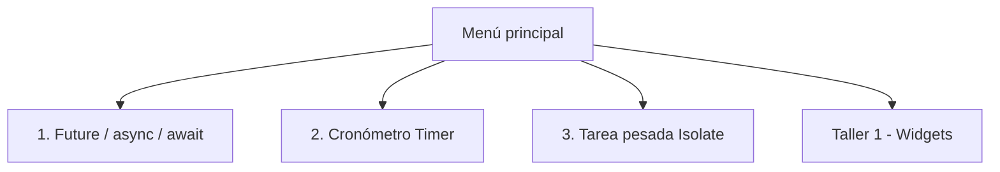
```mermaid
flowchart TD
    M[Menú principal] --> F[1. Future / async / await]
    M --> T[2. Cronómetro Timer]
    M --> I[3. Tarea pesada Isolate]
    M --> T1[Taller 1 - Widgets]
```

### 1. Future / async / await (`lib/taller3/screens/future_page.dart`)
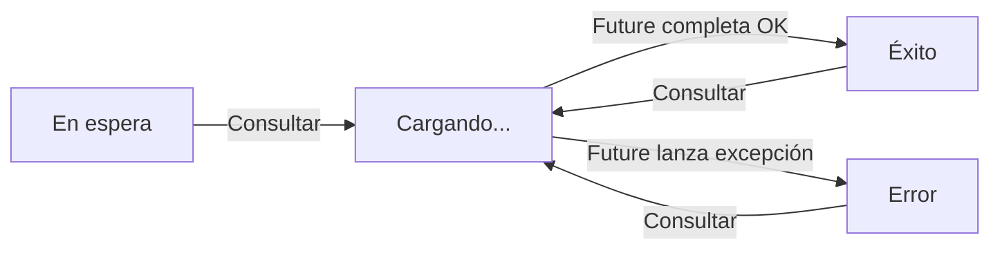
```mermaid
flowchart LR
    A[En espera] -->|Consultar| B[Cargando...]
    B -->|Future completa OK| C[Éxito]
    B -->|Future lanza excepción| D[Error]
    C -->|Consultar| B
    D -->|Consultar| B
```
- El servicio simula 3 s de latencia con `Future.delayed`.
- Se imprime en consola (y en pantalla) el orden: **ANTES → DURANTE → DESPUÉS**.
- El botón "Consultar con error" fuerza el estado *Error*.

### 2. Cronómetro (`lib/taller3/screens/timer_page.dart`)
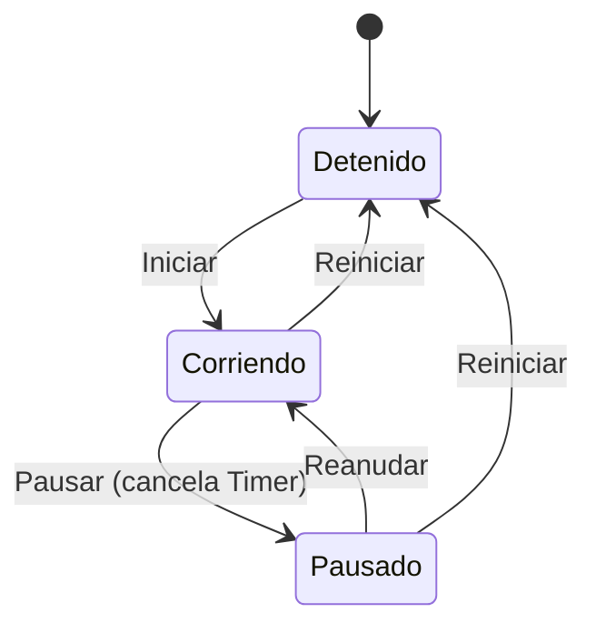
```mermaid
stateDiagram-v2
    [*] --> Detenido
    Detenido --> Corriendo: Iniciar
    Corriendo --> Pausado: Pausar (cancela Timer)
    Pausado --> Corriendo: Reanudar
    Corriendo --> Detenido: Reiniciar
    Pausado --> Detenido: Reiniciar
```
- `Timer.periodic` de 100 ms refresca la pantalla; un `Stopwatch` mide el tiempo real.
- El `Timer` se cancela al pausar, al reiniciar y en `dispose()` (al salir de la vista).

### 3. Proceso pesado con Isolate (`lib/taller3/screens/isolate_page.dart`)
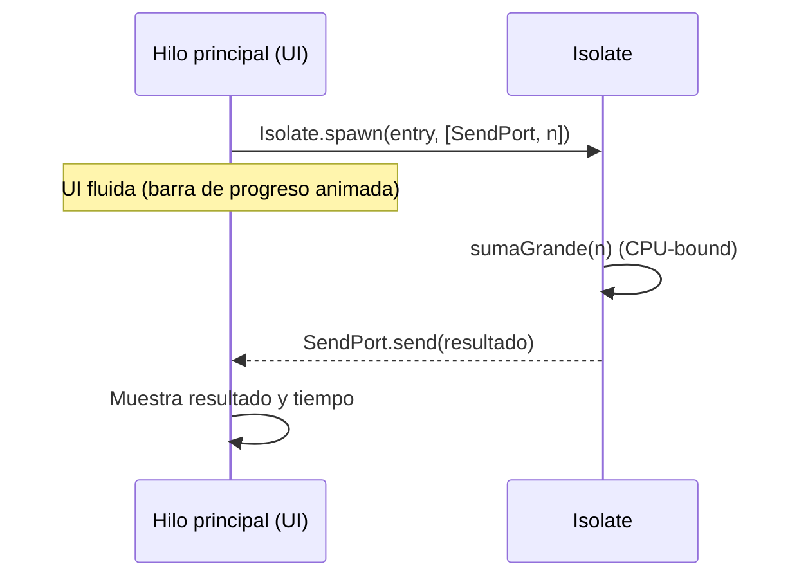
```mermaid
sequenceDiagram
    participant UI as Hilo principal (UI)
    participant I as Isolate
    UI->>I: Isolate.spawn(entry, [SendPort, n])
    Note over UI: UI fluida (barra de progreso animada)
    I->>I: sumaGrande(n) (CPU-bound)
    I-->>UI: SendPort.send(resultado)
    UI->>UI: Muestra resultado y tiempo
```
- Botón **"Ejecutar con Isolate"**: la UI sigue respondiendo.
- Botón **"Ejecutar sin Isolate"**: mismo cálculo en el hilo principal; la UI se congela (comparación).

## Estructura del código

```
lib/
├── main.dart                      # Menú principal
├── taller1/home_page.dart         # Taller 1
└── taller3/
    ├── services/
    │   ├── datos_service.dart     # Future.delayed (servicio simulado)
    │   └── heavy_task.dart        # Función CPU-bound + Isolate.spawn
    └── screens/
        ├── future_page.dart
        ├── timer_page.dart
        └── isolate_page.dart
```

## Cómo ejecutar

```bash
git clone https://github.com/Johan-salgado/repositorio-proyecto-personal-ELECTIVA-PROFESIONAL-I..git
cd repositorio-proyecto-personal-ELECTIVA-PROFESIONAL-I.
git checkout feature/taller_segundo_plano
flutter pub get
flutter run
```
> Para tiempos realistas del Isolate usa `flutter run --profile` o `--release` (en modo debug Dart es más lento).

## Capturas de evidencia

### 1. Cronómetro (Timer)

**Iniciar** – el marcador avanza cada 100 ms y el estado es «corriendo».


**Pausar** – el Timer se cancela y el tiempo queda detenido.

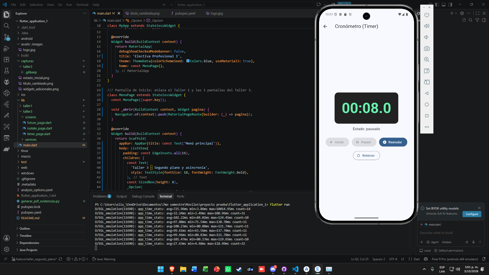

**Reanudar** – el conteo continúa desde el tiempo acumulado.

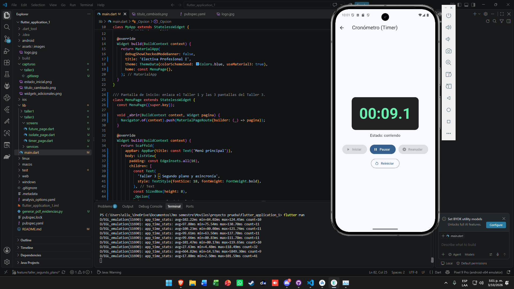

**Reiniciar** – vuelve a 00:00.0 y el estado a «detenido».

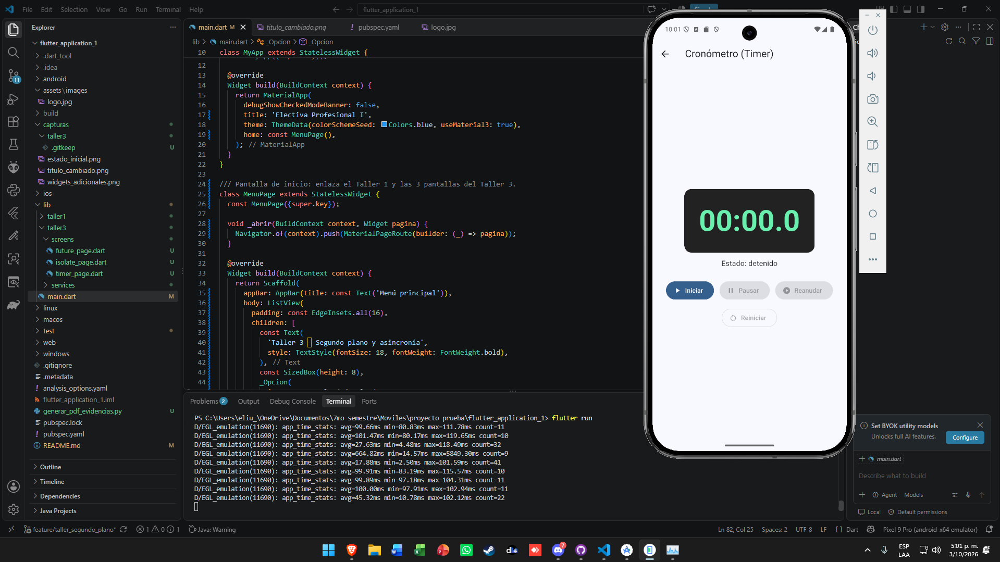

### 2. Future / async / await

**Cargando…** – durante los 3 s del `Future.delayed`; la UI no se bloquea.

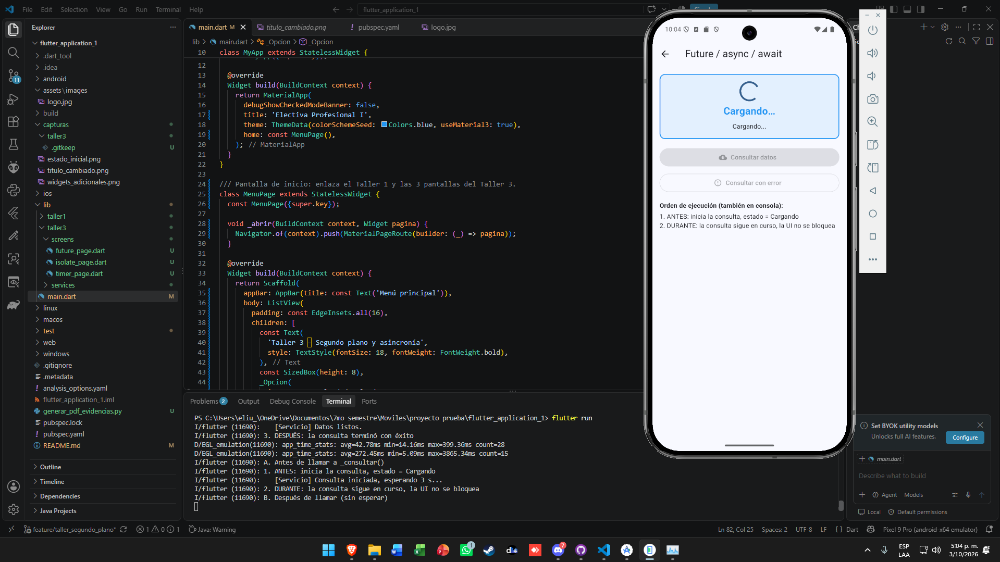

**Éxito** – el `await` entrega el resultado.

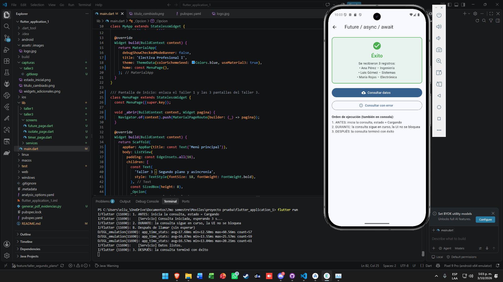

**Error** – la excepción se captura con `try/catch`.

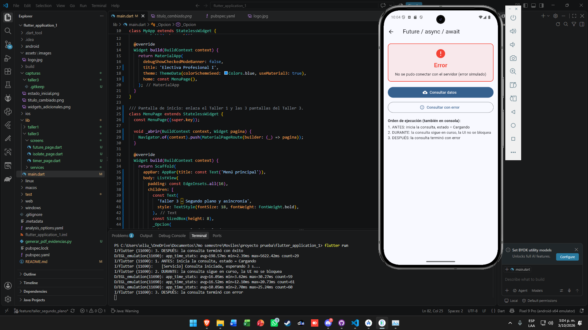

**Consola** – orden de ejecución ANTES → DURANTE → DESPUÉS.

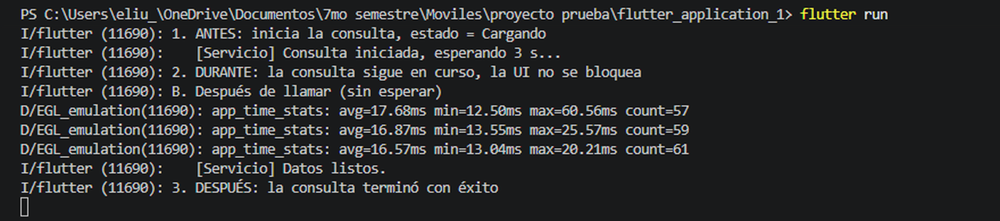

### 3. Isolate (tarea pesada)

**Ejecutando** – la barra de progreso se anima: la UI sigue libre.

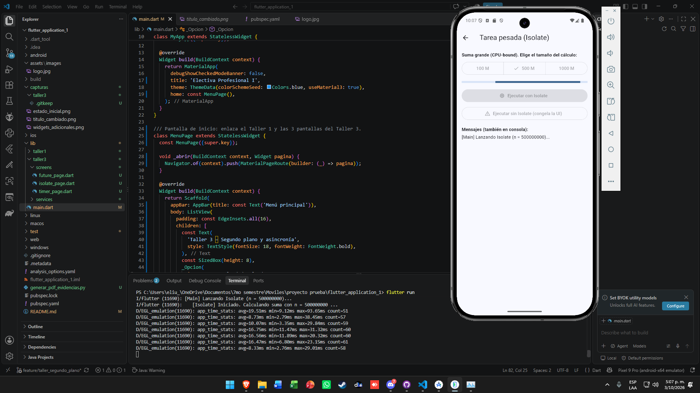

**Resultado y tiempos** – resultado recibido por mensaje y tiempo empleado.

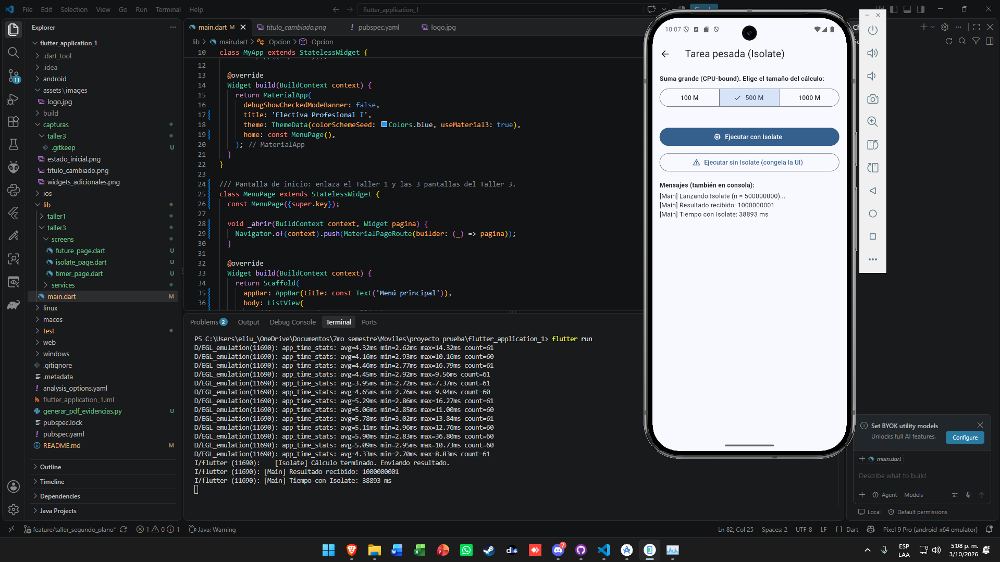

**Consola** – mensajes de `[Main]` e `[Isolate]`.

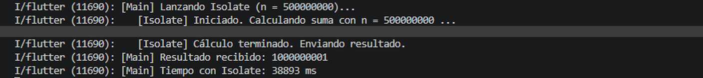

**Comparación sin Isolate** – el mismo cálculo en el hilo principal congela la UI y Android muestra «isn't responding».

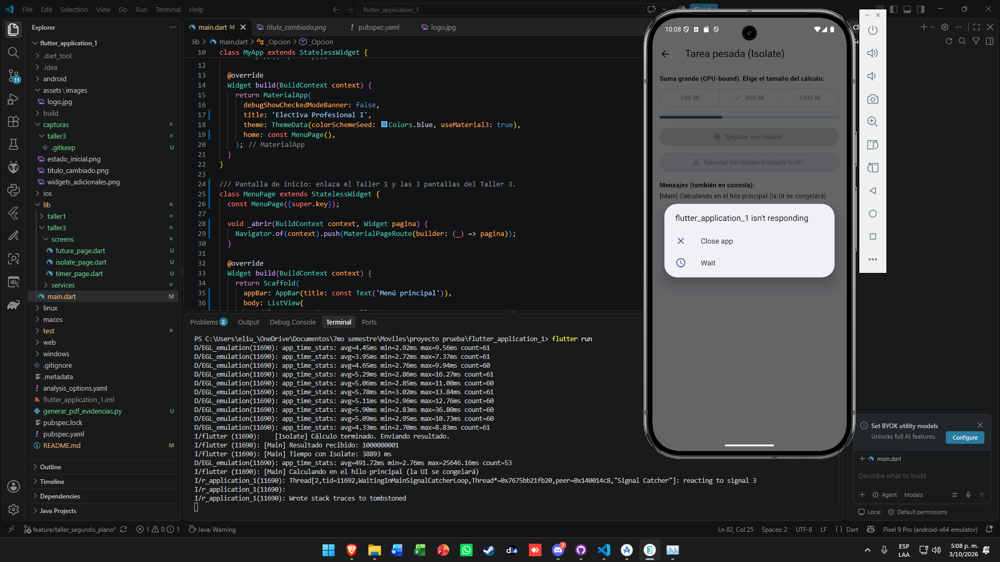

## Flujo de trabajo Git (Git Flow)

1. `git checkout dev && git pull`
2. `git checkout -b feature/taller_segundo_plano`
3. Commits en la rama del taller.
4. Pull Request `feature/taller_segundo_plano` → `dev`; revisión y merge.
5. Integración de `dev` → `main`.

## Repositorio

https://github.com/Johan-salgado/repositorio-proyecto-personal-ELECTIVA-PROFESIONAL-I..git

---

# Taller 1 – Flutter + Widgets + Git Flow

## Descripción

Este taller consiste en construir una pantalla básica en Flutter utilizando un
`StatefulWidget`, evidenciando el uso de `setState()` para actualizar la interfaz
de forma dinámica. La pantalla incluye un `AppBar` con título variable, imágenes
cargadas desde red y desde assets locales, un botón que cambia el estado de la
aplicación mostrando un `SnackBar`, y widgets adicionales (`Container` y `ListView`)
organizados con buenas prácticas de diseño visual.

Además, se aplicó un flujo de trabajo Git Flow: todos los cambios se desarrollaron
en la rama `feature/taller1`, creada a partir de `dev`, y luego integrados mediante
Pull Requests hacia `dev` y posteriormente hacia `main`.

## Datos del estudiante

- **Nombre completo:** Johan Eliu Salgado Castro
- **Código:** 230232033
- **Asignatura:** Electiva profesional I
- **Taller:** Taller 1 – Flutter + Widgets + Git Flow

## Requisitos técnicos implementados

- `AppBar` con título inicial "Hola, Flutter", controlado por una variable de estado.
- `Text` centrado con el nombre completo del estudiante.
- `Row` con dos imágenes: una cargada con `Image.network()` y otra con `Image.asset()`.
- `ElevatedButton` que alterna el título de la `AppBar` entre "Hola, Flutter" y
  "¡Título cambiado!" usando `setState()`.
- `SnackBar` con el mensaje "Título actualizado" al presionar el botón.
- Widgets adicionales:
  - `Container` con márgenes, color de fondo y bordes.
  - `ListView` con 4 elementos, cada uno con ícono y texto.
- Diseño organizado con `Column`, `Padding`, `SizedBox` y alineaciones adecuadas.

## Uso de StatefulWidget y setState()

La pantalla principal (`HomePage`) es un `StatefulWidget` porque necesita mantener
y modificar un estado interno mientras la aplicación está en ejecución: en este
caso, la variable booleana `_cambiado`, que determina el texto mostrado en el
`AppBar`. Cada vez que el usuario presiona el botón "Cambiar título", se llama al
método `_cambiarTitulo()`, el cual invoca `setState()` para alternar el valor de
`_cambiado`. Esto le indica a Flutter que debe volver a ejecutar el método `build()`
y redibujar la interfaz con el nuevo valor, reflejando el cambio de título de forma
inmediata en pantalla, además de mostrar el `SnackBar` de confirmación.

## Pasos para ejecutar el proyecto

1. Clonar el repositorio:
```bash
   git clone https://github.com/Johan-salgado/repositorio-proyecto-personal-ELECTIVA-PROFESIONAL-I..git
```
2. Entrar a la carpeta del proyecto:
```bash
   cd flutter_application_1
```
3. Cambiar a la rama del taller (opcional, si no está en `main`):
```bash
   git checkout feature/taller1
```
4. Instalar las dependencias:
```bash
   flutter pub get
```
5. Ejecutar la aplicación (con un emulador o dispositivo físico conectado):
```bash
   flutter run
```

## Capturas de pantalla

### Estado inicial de la aplicación
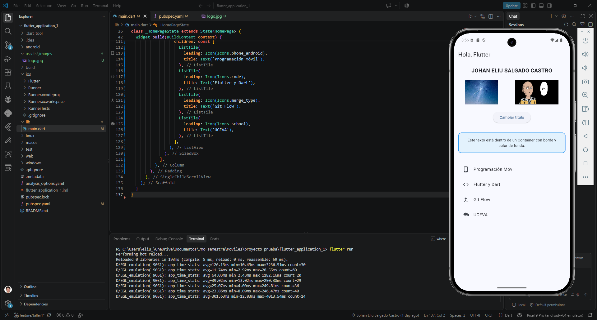

### Título cambiado + SnackBar
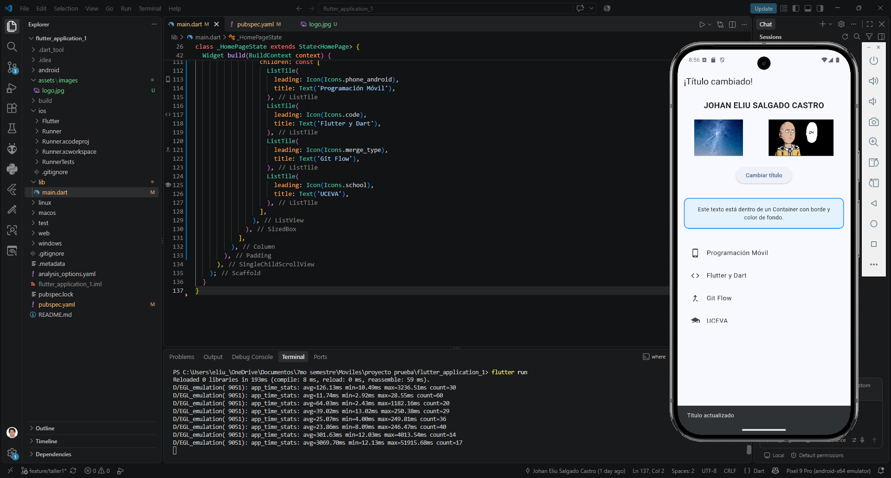

### Widgets adicionales (Container + ListView)
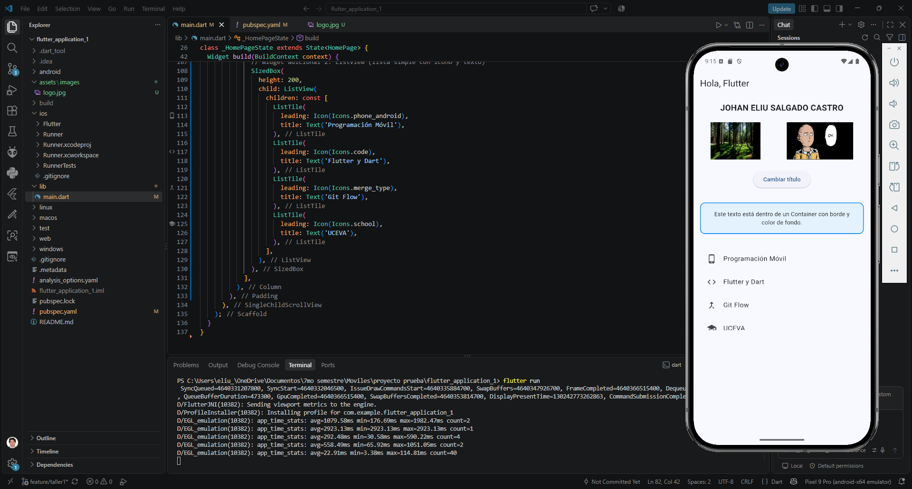

## Flujo de trabajo Git

- Rama del taller: `feature/taller1`, creada desde `dev`.
- Commits realizados en `feature/taller1` con mensajes descriptivos.
- Pull Request de `feature/taller1` → `dev`, revisado e integrado.
- Pull Request de `dev` → `main`, revisado e integrado.

## Repositorio

https://github.com/Johan-salgado/repositorio-proyecto-personal-ELECTIVA-PROFESIONAL-I..git
